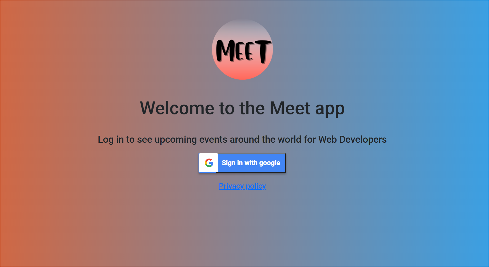

# meet App

## Overview

This is a serverless, progressive web application (PWA) built with React using a test-driven development (TDD) technique. The application uses the Google Calendar API to fetch upcoming events.

[Check the live project here](https://alemtola.github.io/meet/)

#### Sample project view

Login View:   Users can have access to the app by signning using their google account. 

Main View:   This is the main page where users search for events from different cities, define the number of events they want to see and display a chart to visualize the search data. 

Event List:   When Users click on 'Show Details' button, event detail is displayed. 

## Key Features

1. Filter events by city.
2. Show/hide event details.
3. Specify number of events.
4. Use the app when offline.
6. View a chart showing the number of upcoming events by city.

## User Stories and Scenarios

### FEATURE 1: FILTER EVENTS BY CITY 

#### User Story
As a user I should be able to filter events by city So that I can see the list of events that take place in that city

#### Scenarios

**Scenario 1: When user hasn’t searched for a city, show upcoming events from all cities.** 

- Given a user has not searched for a city,
- When the user opens the app,
- Then the user should see all upcoming events from all cities.

**Scenario 2: User should see a list of suggestions when they search for a city.** 

- Given a user wants to see all upcoming events in a city,
- When the user types the specific city in the search bar,
- Then the user should see a list of suggestions for a city.

**Scenario 3: User can select a city from the suggested list.** 

- Given a user types the city name in an input field for city,
- When the list of suggestions appears,
- Then the user can select the city from the suggested list.

### FEATURE 2: SHOW/HIDE AN EVENT'S DETAILS

#### User Story:
As a user, I should be able to show or hide event details so that I can see more or less
information about an event

#### Scenarios

**Scenario 1: An event element is collapsed by default** 

- Given the user has searched for events by city
When user has list of suggested events
Then event elements should be displayed collapsed

**Scenario 2:User can expand an event to see its details** 

- Given the user had list of suggested events
- When user clicks 'Show Details' button for a given event element
- Then the user should see more information for an event

**Scenario 3: User can collapse an event to hide its details** 

- Given the user has expanded the event for its details
- When user clicks 'Hide Details' button for a given event element
- Then the user should see a collapsed event element hiding its details

### FEATURE 3: SPECIFY NUMBER OF EVENTS

#### User Story:
As a user, I would like to be able to specify the number of events I want to view in the app so
that I can see more or fewer events in the events list at once.

#### Scenarios

**Scenario 1: When user hasn’t specified a number, 16 is the default number**

- Given the user is on the main page
- When the user does not specify number of events
- Then the user should see 16 events by default

**Scenario 2: User can change the number of events they want to see**

- Given the user has searched for events 
- When the user specifies the number of events to see
- Then the user should see the specified number of events 

### FEATURE 4: USE THE APP WHEN OFFLINE

#### User Story:
As a user, I would like to be able to use the app when offline so that I can see the events I
viewed the last time I was online.

#### Scenarios

**Scenario 1: Show cached data when there’s no internet connection**

- Given the user is offline
- When the user opens the app
- Then the user should see the cached data of events from previous search 

**Scenario 2: Show error when user changes the settings (city, time range)**

- Given the user is offline
- When the user wants to change the settings
- Then the user should see an erroe message

### FEATURE 5: DATA VISUALIZATION

#### User Story:
As a user, I would like to be able to see a chart showing the upcoming events in each city so
that I know what events are organized in which city.

#### Scenario

**Scenario 1: Show a chart with the number of upcoming events in each city**

- Given the main page is open
- When the user wants to see graphical data about upcoming events 
- Then the user should see a chart showing the upcoming events in each city